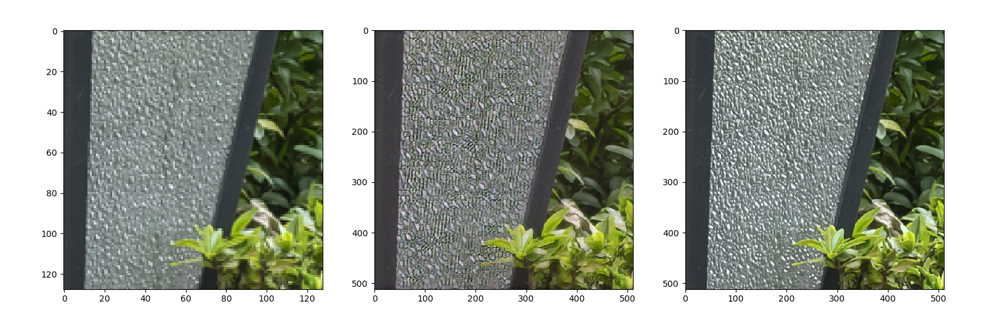

# CV-exercise
## Introduction
This is a repository for some of my PyTorch practices. Mainly consists of generative models.

Including:

+ GANs
	* DCGAN
	* SRGAN
+ VAEs
	* Vanilla VAE
+ Diffusion Models
	* DDPM
+ Vision Transformers
	* ViT

## TODO
* Add argument parses
* Use wandb
* Implement NeRF
* Implement SR3(diffusion involved)
* Implement Feature Transfer Models
* ...

## References
### Publications
* ViT: 
   * An Image is worth 16x16 Words: Transformer for Image Recognition at Scale, Dosovitskiy et al. (https://arxiv.org/abs/2010.11929v2)
   * Attention is all you need, Vaswani et al. (https://arxiv.org/abs/1706.03762v5)

* DDPM:
   * Denoising Diffusion Probabilistic Models, Ho et al. (https://arxiv.org/abs/2006.11239v2)

* Vanilla VAE:
   * Auto-Encoding Variational Bayes, Kingma et al. (https://arxiv.org/abs/1312.6114v11)
   * EECS498 of UM

* DCGAN:
   * EECS498 of UM

* SRGAN:
   * Photo-Realistic Single Image Super-Resolution Using a Generative Adversarial Network, Ledig et al. (https://arxiv.org/abs/1609.04802v5)

* UNets:
   * U-Net Convolutional Networks for Biomedical Image Segmentation, Ronneberger et al. (https://arxiv.org/abs/1505.04597v1)
   * Attention U-Net: Learning Where to Look for the Pancreas, Oktay et al. (https://arxiv.org/abs/1804.03999v3) (Much better representing performance! An even better implementation is UNet with Transformers)

### Projects from Git
* https://github.com/lukemelas/PyTorch-Pretrained-ViT
* https://github.com/google-research/vision_transformer
* https://github.com/lucidrains/vit-pytorch
* https://github.com/abarankab/DDPM
* https://github.com/timbmg/VAE-CVAE-MNIST

## Settings
### Datasets
Datasets should be download to `data` directory as the datasets implementation files(.py in `datasets`) require.
Including: SVHN, RealSR, CelebA
### Requirements
Pytorch, cudatoolkit, cuDNN, numpy, pandas, scikit-image, matplotlib, pillow, tqdm

## Some of the results
### Vanilla VAE
CelebA:

### DCGAN
CelebA:

### SRGAN
RealSR: Low Resolution | Super Resolution (4x) | High Resolution (4x)

